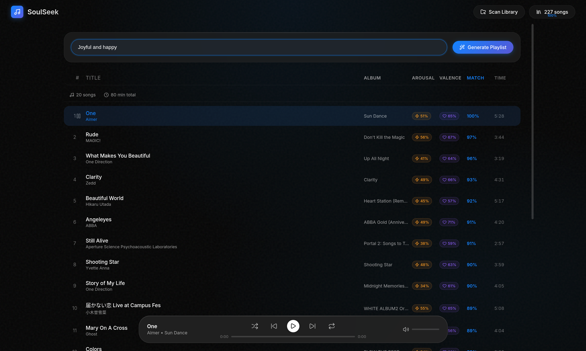

# SoulSeek: AI Mood Based Music Player

A local-first, AI-powered music player that generates playlists based on natural language mood descriptions.



## Features

- **Natural Language Playlist Generation**: Describe your mood (e.g., "Sad songs for a rainy day", "High energy workout music", "Chill vibes but not too slow") and get a perfectly matched playlist
- **Multi-Signal AI Scoring**: Combines semantic embeddings, audio features, genre matching, and lyrics emotion analysis for accurate recommendations
- **Comprehensive Audio Analysis**:
  - BPM detection with octave correction
  - Energy, brightness, and dynamic range
  - Musical key and mode (Major/Minor)
  - Valence (happy/sad) and arousal (calm/energetic)
  - MFCCs and spectral features
- **Lyrics Integration**: Automatically fetches lyrics and analyzes emotional content using AI
- **Negation Support**: Queries like "sad but not slow" or "energetic but not aggressive" work intelligently
- **Privacy Focused**: Runs entirely locally. Your music and data never leave your machine
- **Modern Interface**: Clean, glassmorphic dark UI with full audio player controls

## Tech Stack

- **Backend**: FastAPI, SQLite
- **AI/ML**: 
  - Sentence-Transformers (`all-mpnet-base-v2`) for semantic matching
  - HuggingFace (`j-hartmann/emotion-english-distilroberta-base`) for lyrics emotion
  - Librosa for audio feature extraction
- **Frontend**: Vanilla JavaScript, CSS with glassmorphism design
- **Audio**: HTML5 Audio API with range request support

## Getting Started

### Prerequisites

- Python 3.8+
- A folder with music files (.mp3, .flac, .wav, .m4a, .ogg)

### Installation

1. Clone the repository
   ```bash
   git clone https://github.com/AnkitBangadkar/Mood-Based-Music-Player.git
   cd soulseek
   ```

2. Create and activate a virtual environment
   ```bash
   python -m venv venv
   source venv/bin/activate  # Linux/Mac
   # or
   venv\Scripts\activate     # Windows
   ```

3. Install dependencies
   ```bash
   pip install -r requirements.txt
   ```

### Usage

1. Start the server
   ```bash
   python main.py
   ```

2. Open `http://localhost:8000` in your browser

3. Click **Scan Library** and enter the absolute path to your music folder

4. Wait for the scan to complete (analyzes audio features, fetches lyrics, builds embeddings)

5. Type a mood description and click **Generate Playlist**

## How It Works

The playlist generation uses a weighted ensemble scoring system:

| Signal | Weight | Description |
|--------|--------|-------------|
| Semantic Similarity | 35% | Matches your query to song mood descriptions using sentence embeddings |
| Audio Features | 40% | Gaussian matching for BPM, energy, valence, brightness, etc. |
| Genre Matching | 12% | Keyword-based genre detection and matching |
| Lyrics Emotion | 13% | AI emotion classification of song lyrics |

## License

MIT License
