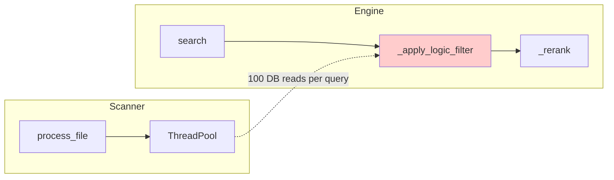

# 🧠 CTO Code Review: Mood Playlist Generator

**Reviewer:** Senior Dev / CTO  
**Date:** Jan 7, 2026  
**Codebase Version:** Tier 2 "Normal" Architecture

---

## Executive Summary

This is a **well-architected local AI system** that generates mood-based playlists using a sophisticated hybrid vector search approach. The tiered architecture (Low/Normal/High) is smart and the separation of concerns across modules is clean. 

**Current State:** ~80% production-ready. The core ML pipeline is solid. Primary gaps are in error resilience, test coverage, and production hardening.

---

## 1. Architecture Review ✅

### Strengths

| Component | Assessment |
|-----------|------------|
| **Tiered ML Pipeline** | Excellent design. BGE-small → Cross-Encoder reranking is industry best practice |
| **Hybrid Vectors** | Storing 3 separate vectors (lyrics/audio/meta) with weighted fusion is smart |
| **FastAPI + SQLite** | Perfect for local-first, zero-config deployment |
| **Multi-threading** | 8 workers in scanner gives ~3-4x speedup on multi-core systems |

### Concerns



**The DB Read Pattern in `_apply_logic_filter`** (engine.py L126-146) reads 100 songs individually from SQLite to check sentiment guardrails. This is **N+1 query antipattern**.

---

## 2. Bugs & Issues 🐛

### CRITICAL

| File | Line | Issue |
|------|------|-------|
| `lyrics_scraper.py` | 45 | **`os` not imported** - `os.getenv()` will fail at runtime |
| `scanner.py` | 24, 61 | Duplicate `import os` inside functions. Works, but indicates import confusion |

### HIGH

| File | Issue |
|------|-------|
| `engine.py` | Fixed today: Empty list IndexError + score normalization issues |
| `database.py` | No connection pooling - thread contention possible under load |
| `sentiment.py` L54-56 | VADER fallback is a **stub** that returns 0.0 - breaks "low" tier |

### MEDIUM

| File | Issue |
|------|-------|
| `analyzer.py` L43, 84, 96 | Bare `except:` clauses swallow errors silently |
| `lyrics_extractor.py` | Thread-unsafe: `import os` inside function is defensive but indicates threading concerns |

---

## 3. Performance Observations ⚡

### Current Benchmarks (from logs)
- **Scan Speed:** ~30 songs in 19-28s (depends on network for lyrics)
- **Generation Speed:** ~15ms once index loaded

### Bottlenecks

1. **Online Lyrics Fetch:** 3s timeout per song × 30 songs = potential 90s+ scan time
   - Many timeouts visible in logs (OVH, Genius)
   
2. **Model Loading:** ~5s on startup for embedding + reranker models
   - Already using lazy loading ✅
   
3. **Memory:** Loading 3 vectors per song into RAM
   - At 384-dim × 4 bytes × 3 vectors × 50k songs = ~230MB - acceptable

---

## 4. Code Quality Assessment

### Good Patterns ✅
- Singleton pattern for engine/sentiment (avoids model reload)
- Configurable feature flags via env vars
- Clean module separation (single responsibility)
- Comprehensive logging infrastructure

### Anti-Patterns ⚠️

```python
# scanner.py L35, analyzer.py L43 - Bare except
try:
    audio = EasyID3(filepath)
except:  # ← What exceptions? We'll never know
    audio = mutagen.File(filepath, easy=True)
```

```python
# database.py - No context manager, no pooling
def get_song_by_id(song_id):
    conn = get_connection()  # Opens new connection
    cursor = conn.cursor()
    # ... query ...
    conn.close()  # Closes immediately
    return song
```

---

## 5. Security Considerations 🔒

| Risk | Severity | Notes |
|------|----------|-------|
| **SQL Injection** | Low | Using parameterized queries ✅ |
| **Path Traversal** | Low | No user input sanitization on fs paths - but local-only app |
| **Web Scraping** | Medium | Genius/OVH scraping may violate ToS - document this |
| **API Key Exposure** | Low | Musixmatch key in env var - good |

---

## 6. Recommendations 📋

### Immediate (Pre-Release)

1. **Fix `os` import in `lyrics_scraper.py` line 45**
   ```python
   import os  # Add at top of file
   ```

2. **Implement VADER fallback for "low" tier**
   ```python
   # sentiment.py
   from vaderSentiment.vaderSentiment import SentimentIntensityAnalyzer
   vader = SentimentIntensityAnalyzer()
   return vader.polarity_scores(text)['compound']
   ```

3. **Add connection pooling to database.py**
   ```python
   import threading
   _local = threading.local()
   
   def get_connection():
       if not hasattr(_local, 'conn'):
           _local.conn = sqlite3.connect(DB_PATH, check_same_thread=False)
           _local.conn.row_factory = sqlite3.Row
       return _local.conn
   ```

### Short-Term (Post-MVP)

4. **Batch the logic filter DB reads**
   ```python
   # Instead of 100 individual reads, do:
   song_ids = [c['id'] for c in candidates]
   songs = database.get_songs_by_ids(song_ids)  # Single query
   ```

5. **Add retry logic for lyrics scraping**
   - Exponential backoff on timeout
   - Circuit breaker after N failures

6. **Better exception handling**
   - Replace bare `except:` with specific exceptions
   - Log stack traces for debugging

### Long-Term (Tier 3 / v2.0)

7. **Consider FAISS for vector search**
   - Current NumPy similarity is O(n) per query
   - FAISS gives O(log n) with IVF index
   - Worth it at >10k songs

8. **Audio embedding model**
   - Replace librosa heuristics with actual audio transformer (e.g., CLAP, Music2Emo)
   - Much better "vibe" understanding

9. **User feedback loop**
   - "Wrong song" button to fine-tune local reranker
   - Personalization over time

---

## 7. Testing Gaps 🧪

Current test files found:
- `auto_test.py` - Integration test (manual)
- `test_engine.py` - Unit test
- `test_setup.py` - Setup verification

### Missing Tests
| Area | Type | Priority |
|------|------|----------|
| Sentiment fallback | Unit | High |
| Database edge cases | Unit | Medium |
| Lyrics extraction | Unit | Medium |
| API error responses | Integration | High |

---

## 8. Final Score

| Category | Score |
|----------|-------|
| Architecture | ⭐⭐⭐⭐ (4/5) |
| Code Quality | ⭐⭐⭐ (3/5) |
| Error Handling | ⭐⭐ (2/5) |
| Test Coverage | ⭐⭐ (2/5) |
| Performance | ⭐⭐⭐⭐ (4/5) |
| **Overall** | **⭐⭐⭐ (3.0/5)** |

**Verdict:** Solid foundation, needs production hardening. The ML architecture is above average for a local app. Focus next sprint on error handling and the identified bugs.

---

*Review generated by CTO analysis session. All recommendations should be prioritized with product team.*
